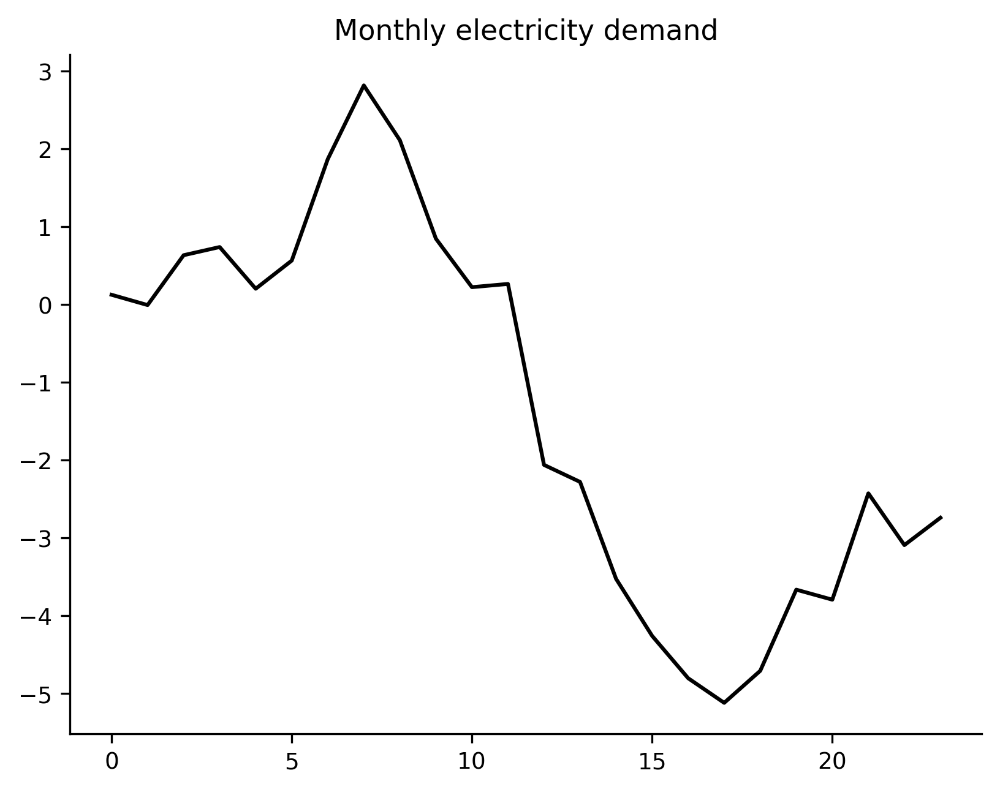
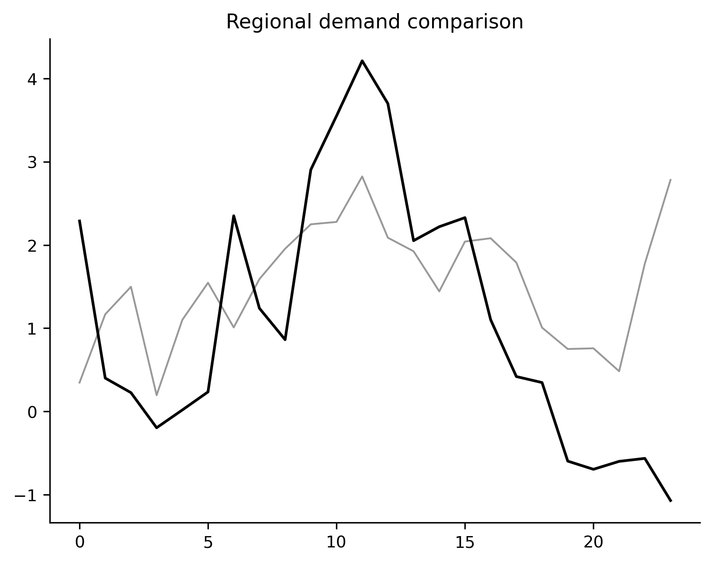
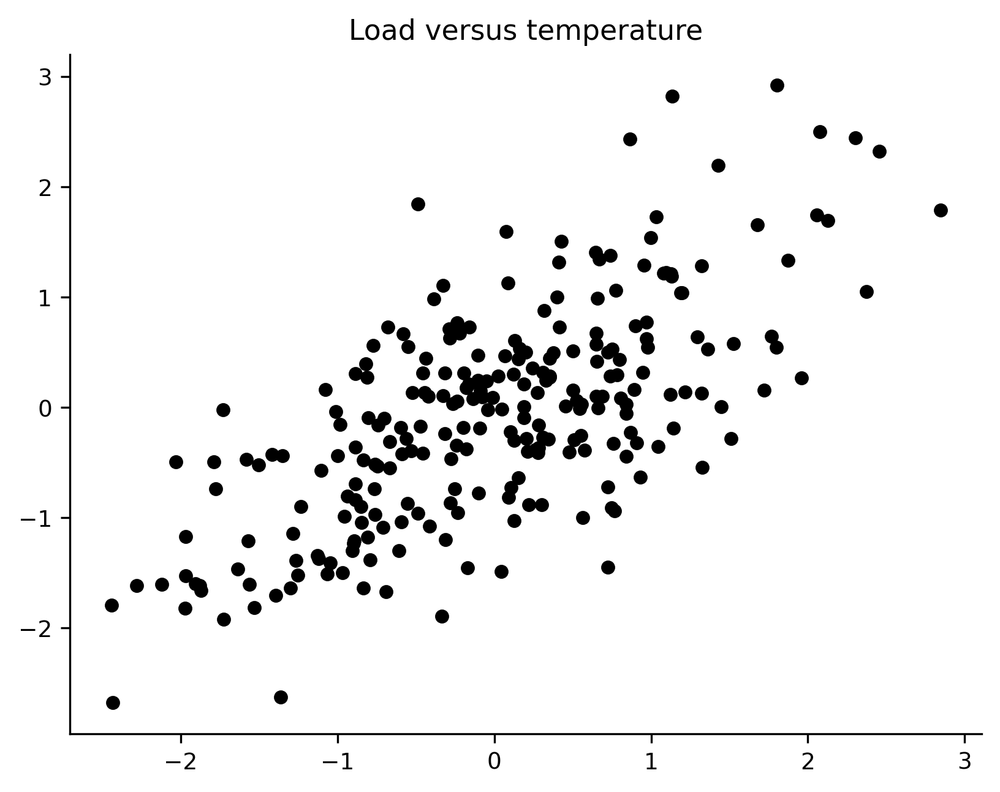
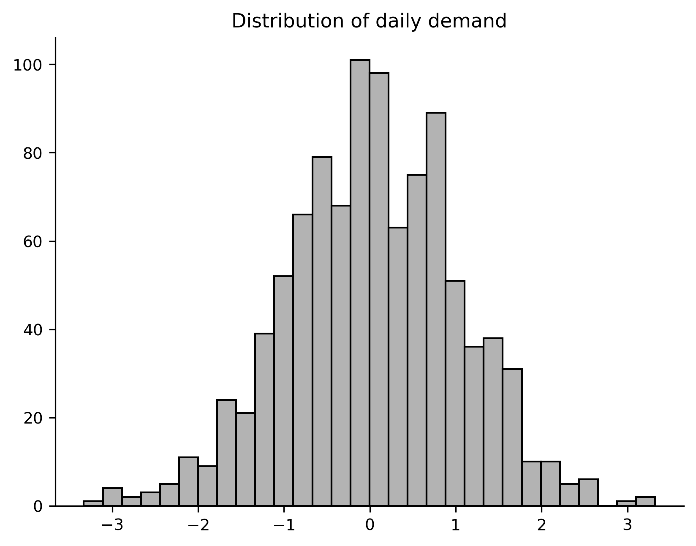
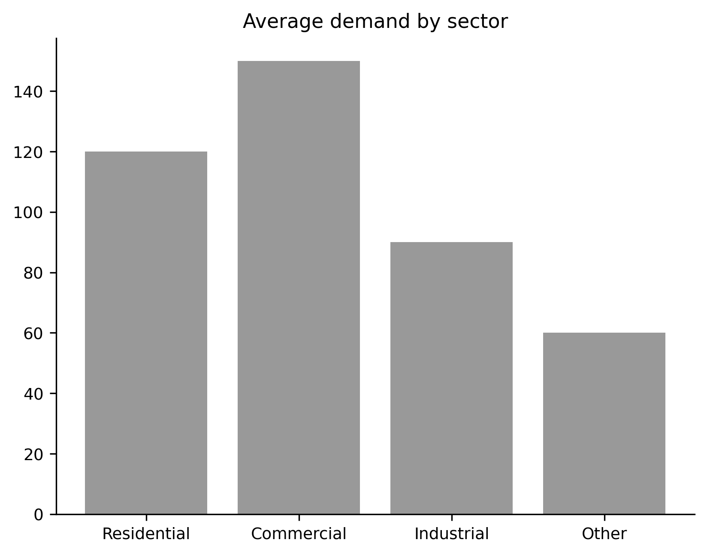
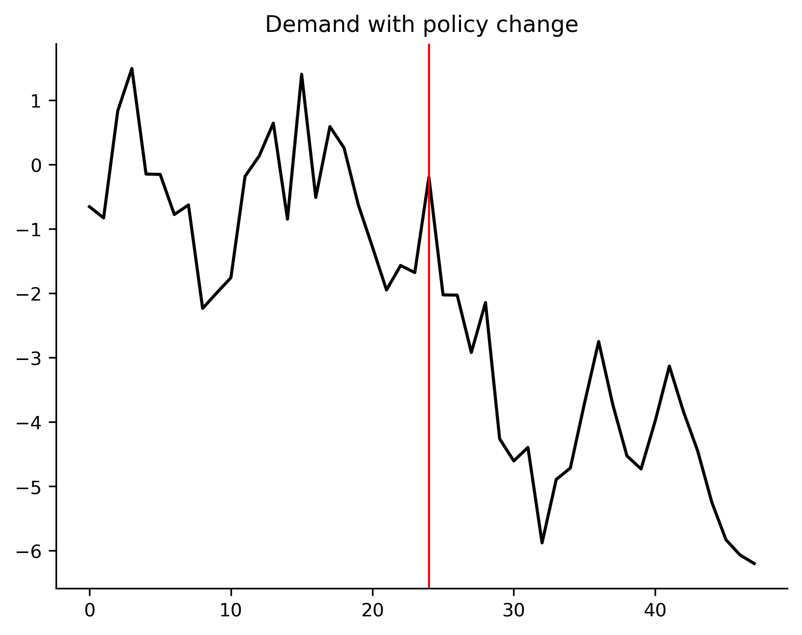

Gallery
=======

SignalPlot ships a small cookbook of example scripts under :mod:`examples`.
This gallery shows the figures those scripts produce so users can see the
intended outcomes before copying patterns into their own projects.

Each image corresponds to a runnable script in ``examples/``.

Time series line
----------------

Multiple line comparison
------------------------

Scatter relationship
--------------------

Histogram distribution
----------------------

Bar chart with honest scale
---------------------------

Event highlight
---------------

To regenerate these images, run the scripts in ``examples/`` and save the
output PNGs into ``docs/_static/gallery/`` with the matching filenames.

